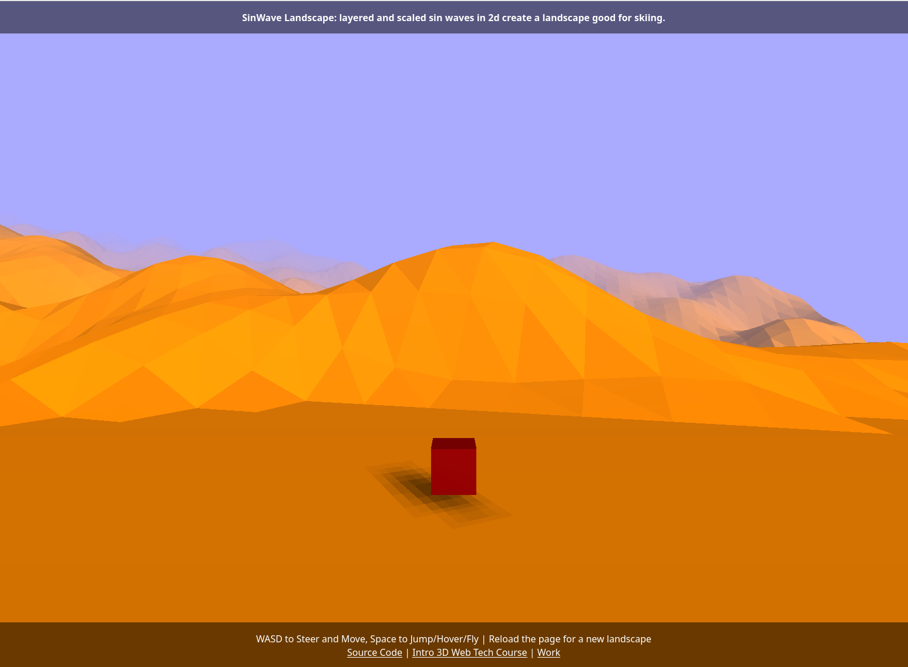

# Sin Wave Landscape

stacked sine waves to create fun slopey landscape. 

turns out from down close on the landscape this looks pretty naturalistic.

## credits go to
 - threejs
 - cannonjs
 - webpack
 - npm
 
## live demo is here

 - http://seanbutler.github.io/SinWaveLandscape/dist

reload to get a new one.

## pic

